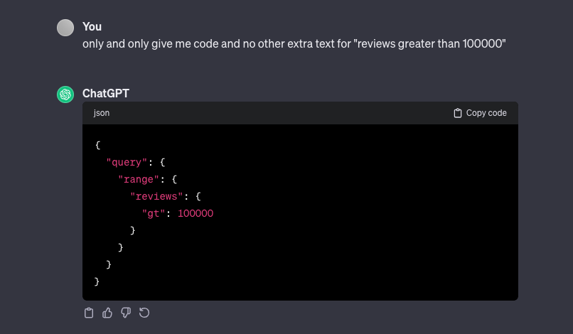

# segwise.ai assignment

Deployed at => https://segwise-assignment-sameer.vercel.app/

## Requirements

Showcase your skills by demonstrating different kinds of charts, graphs and map visualisations:

> Created various charts to visualize aggregated data from both the files.

All visualisations should be interactive with the possibility of changing filters, dimensions or parameters on the x/y axis. Showcase variation apps based on categories, install, type etc.

> Added app name based interaction, for other interactions, I tried the free text search logic and indexed the data in elasticsearch. Based on that I tried prompts on chatGPT to create query payload for our defined types.

We should be able to visualise app data based on sentiment from the second file as well.

> Done! we aggregate at two levels - global & app.

Also build a search functionality where a customer can search by any of the field values ie Type=Free. Search page should show paginated responses.

> Due to time constraints this is not possible, but I've created scripts to ingest data in elasticsearch and possibility of using elasticsearch's ELSER offering.
> Since this comes under paid pricing, could not integrate only this, for reference: https://www.elastic.co/guide/en/elasticsearch/reference/current/semantic-search-elser.html

Apart from above major points:
- Dashboard is responsive.
- Insights are provided based on what apps are doing well in the market.
- Used libraries such as nextjs, shadcn ui, tailwindcss, lodash, recharts, etc.
- Parsing scripts to create data in chunks for various aggregation results, fully type safe.

## Bonus Points

### If you can support searching in normal english using a free generative AI api. For eg a query like this: how many apps have size > 10?

> Checkout `SearchTab` component which includes free search capability. Due to time constrating I'm showing elasticsearch output as the result. Couldn't find any relevant free API to get back result, for completion and data flow purposes added the openAI example.

For now only this query is working: how many apps have reviews > 10000.

This is given as example, see screenshot to understand prompt getting used:

for example:

here I'd earlier prompt of my typescript structure of data and how it was indexed in elasticsearch.

### If you can integrate minimal auth, but also please provide demo credentials to log in

Tried to integrate next-auth, kept it as is for now, was working on free text capability as priority.

### If you can provide on what tech debt you might have taken on while working on this, and what steps you might have taken to resolve them if you had more time

- Fix typescript `as Something` and `any` usage => This can be taken care of, due to time constraint left them at some places.
- Common out charts => Charts should be common out so we can create something like Sentry dashboard to allow dynamic creation of charts. Each have separate api calls based on configurations saved, this helps in user customisation.
- Cleanup constants getting copied due to module type differences in nodejs scripts & nextjs.
- Do not directly use shadcn ui components => When we directly use components we may leak design system consistency, to ensure we have consistent design system, they should be wrapped in our own component and we should only expose props as required.
- Better parsing scripts, current parsing scripts divide data in chunks to prevent huge in memory data on client. Later on I tried playing around with elasticsearch and got it working, but have not replaced filters with it.
- Filtering support, with current implementation it's very easy to extend it, as aggregation is easily present and elasticsearch support is done, we can create dynamic filters and hit es query to get data.
